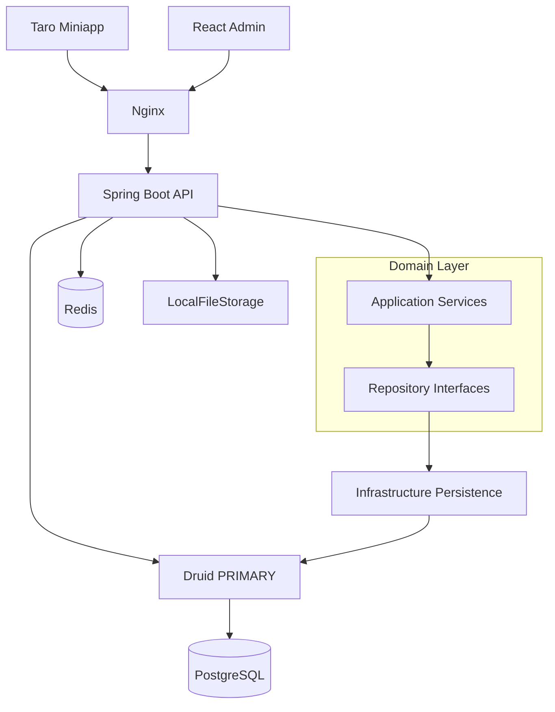

# clumsy_kitchen 全栈交付计划

## 已确认决策

- **微信登录**：`dev` Profile 提供可开关 Mock（`wx.auth.mock-enabled=true`）；`prod` 走真实 `code2session`。密钥仅服务端环境变量。
- **落地节奏**：你批准本计划后，严格按 Phase 1→16 实现；每阶段依赖检查 → 编译 → 测试 → 修复后再进入下一阶段。
- **Spring Boot**：钉死稳定版 **4.0.8**（或实现时 Maven Central 同线最新 patch）；配套 `mybatis-plus-spring-boot4-starter`、`druid-spring-boot-4-starter`。JDK 21。禁止 SNAPSHOT/M/RC。
- **库存并发**：事务 + `UPDATE dish SET stock = stock - ? WHERE id = ? AND stock >= ? AND stock_type = 'LIMITED'`；`UNLIMITED` 不扣减。
- **多数据源**：实现 PRIMARY（PostgreSQL + 独立 Druid）+ SECONDARY 配置骨架（默认 `enabled: false`）；当前不做跨库事务/多租户。
- **绝对禁令**：全栈禁止 `price`/`amount`/`payment` 等商业字段与文案。

## 目标架构



Monorepo 根目录：

```text
clumsy_kitchen/
  server/ miniapp/ admin-web/ sql/ deploy/ docs/
  .env.example .gitignore README.md
```

Java 包：`com.clumsys.kitchen`。前端包名：`@clumsy-kitchen/miniapp`、`@clumsy-kitchen/admin-web`。

## 核心数据模型（摘要）

| 域 | 表 | 要点 |
|---|---|---|
| 身份 | `users`, `admin_users`, `roles`, `permissions`, `user_roles`, `role_permissions` | UUID；RBAC 权限码；BCrypt |
| 菜品 | `dish_category`, `dish`, `dish_image`, `dish_recipe` | `stock`/`stock_type`；`rating NUMERIC(3,2)`；菜谱 JSONB 仅限 ingredients/seasonings/steps/nutrition |
| 预约 | `orders`, `order_items` | 无金额；`order_no` UNIQUE；明细快照 `dish_name` |
| 评价 | `comments`, `comment_images` | `CHECK(rating 1..5)`；`UNIQUE(order_id,dish_id,user_id)` |
| 审计 | `operation_logs` | 不记录密码/Token/AppSecret |

订单状态机（硬约束，禁止任意跳转）：

```text
PENDING → CONFIRMED → PREPARING → READY → COMPLETED
PENDING → CANCELLED
```

用户取消：仅 `PENDING`（实现时在 Domain 规则写死并单测覆盖）。

## API 与统一约定

- 前缀 `/api`；成功 `{code:0,message,data}`；分页含 `records/total/page/pageSize`。
- 用户：微信登录、分类/菜品浏览、预约 CRUD（自有）、评论。
- 管理端：`/api/admin/**`，按权限码鉴权（非 username 硬编码）。
- OpenAPI/Swagger UI；Actuator 仅暴露 `health`（含 DB/Redis）。

## 分阶段交付（Phase 1→16）

### Phase 1 — 项目初始化
- 根 `.gitignore`、`.env.example`、三端脚手架（Maven / Taro+React+TS+Zustand+SCSS / Vite+React+AntD+Zustand）。
- 设计 Token：CSS 变量主色 `#FFB36B`、辅色 `#9DD9C4`、背景 `#FFFDF8` 等。

### Phase 2 — 数据库与 Flyway
- `sql/schema.sql` + `sql/data.sql`（种子：SUPER_ADMIN、基础角色权限、示例分类）。
- Flyway：`db/migration/common` + `postgresql`；TIMESTAMPTZ；必要索引与 FK/CHECK/UNIQUE。

### Phase 3 — 后端基础架构
- 分层：`controller` → `application` → `domain`（model/repository）→ `infrastructure`（entity/mapper/repo/datasource/storage）。
- `ApiResult`、全局异常、Validation、时区策略（DB TIMESTAMPTZ / 服务 UTC / 前端本地显示，写入 README）。
- 排除 Hikari，强制 Druid；`DataSourceFactory/Registry/Router` + `DatabaseType`。

### Phase 4 — 认证与 RBAC
- JWT（用户端 + 管理端可分 issuer/claim）；管理员 `POST /api/admin/auth/login`。
- 微信：`POST /api/auth/wx-login`；Mock 实现隔离在 `infrastructure/wx`，由配置开关。
- Spring Security + 方法级/URL 级权限；越权校验（用户仅能访问自己的订单/评论）。

### Phase 5 — 分类与菜品
- 分类 CRUD、排序、启停；菜品 CRUD、上下架、推荐、库存类型、逻辑删除（有历史订单不可物理删）。
- 用户端只读已上架列表/详情/搜索/热门（`rating DESC, rating_count DESC`）。

### Phase 6 — 菜谱
- 一菜一谱；食材/调味/步骤结构校验；步骤图 URL；管理端完整编辑。

### Phase 7 — 预约单与库存
- 创建预约事务流水线（校验上架 → 扣库存 → `orders` + `order_items`）。
- 管理端状态流转；用户取消；库存回滚规则（取消且曾扣减时回补）。

### Phase 8 — 评论与评分
- 完成单评价资格；唯一约束；隐藏/恢复/删除后重算 `dish.rating/rating_count`；`rebuildDishRating` 管理/内部接口。

### Phase 9 — 微信小程序
- 页面：首页/分类/详情/预约列表与详情/评价创建/我的。
- 组件：`DishCard`、`StarRating`、`OrderCard`、`EmptyState` 等；文案生活化（厨房收到啦…）。
- `src/api` 统一 request + Token；Zustand：`userStore`/`orderStore`。

### Phase 10 — 管理后台
- 路由覆盖 login/dashboard/users/categories/dishes/recipes/orders/comments/admins/roles/permissions/operation-logs。
- Dashboard 仅预约/活跃/评分类指标 + ECharts；`PermissionGuard`；无金额图表。

### Phase 11 — Redis
- 分类/热门菜品缓存、登录辅助、限流、分布式锁（按需）；穿透/失效策略明确；变更时主动失效。

### Phase 12 — 文件存储
- `FileStorageService` + `LocalFileStorageService`；类型/大小/Content-Type 校验；服务端生成文件名；预留 MinIO/S3 接口。

### Phase 13 — Docker / Nginx
- `deploy/docker-compose.yml`：postgres、redis、server、nginx（可选不暴露 DB/Redis 公网端口）。
- Nginx：`/api` 反代、admin 静态、gzip、upload limit；HTTPS 配置模板。

### Phase 14 — Swagger / README
- OpenAPI 完整；README 含品牌文案、非商业声明、版本号、时区、多数据源预留、本地与 Compose 启动、合法域名说明。

### Phase 15 — 自动化测试
- 单元 + 集成：登录、RBAC、库存并发、状态机、评论资格/重复评价、隐藏后评分回算；核心端到端场景（规格 §108）。
- Testcontainers（PostgreSQL/Redis）优先。

### Phase 16 — 最终构建验证
- `mvn clean test package`、`admin-web` build、Taro 微信构建、`docker compose up` 冒烟、验收清单逐条勾选。

## 关键实现要点（避免返工）

- Service **只依赖** Repository 接口，禁止注入 Mapper。
- JSONB / PG 类型仅在 Infrastructure；Domain 用普通 Java 对象。
- 评分字段只读：管理端 API 不接受写入 `rating`/`rating_count`。
- 操作日志 AOP：脱敏；Druid StatView 生产强制认证（环境变量）。
- 前端禁止 `any` 泛滥；核心模型全量 TS 类型。

## 每阶段门禁

每个 Phase 结束必须：依赖可解析、后端编译、相关测试绿、前端类型检查（有代码时）、无商业字段泄漏扫描（简单 grep 禁词）。

## 不在本版本范围

- 支付/价格/积分/优惠券；完整多租户；跨库分布式事务；生产 MinIO 必选（仅接口预留）。
